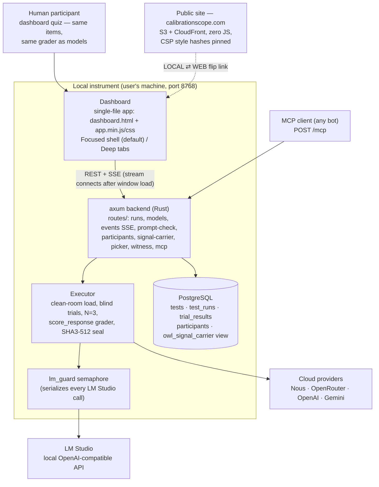

# Architecture — Calibration Scope

Updated 2026-07-28. This document is the maintained architecture reference;
`docs/architecture.excalidraw` predates the Focused shell, the first-run
rungs, human calibration, the Witness generator, and the MCP server, and is
kept only as a drawing source — when the two disagree, this file is current.

## The one-sentence shape

A Rust instrument on the user's own machine measures the gap between what a
system **states** and what is **actually** true — for silicon subjects
(local and cloud models) and carbon subjects (human participants) — through
one schema, one grader, and sealed evidence; a zero-JS public site carries
the lessons.

## System diagram

## Subjects: one schema, both kinds

`test_runs` carries exactly one of `model_id` / `participant_id` (XOR
constraint, migration 043). Every downstream surface — trial rows, seals,
the signal/carrier read, the Witness certificate, the human-cal comparison
panel — handles both kinds from the same columns. Human answers are graded
by `executor::scoring::score_response`, the same function model responses
face (verdict extraction + normalization; parity made literal 2026-07-27).

## The dashboard

- **Source of truth** is `assets/app.js` + `app.css`; `app.min.*` are build
  artifacts from `scripts/build-web.sh` (esbuild, no identifier mangling —
  inline `onclick` needs global names). CI fails if the committed minified
  files are not byte-equal to a fresh build.
- **Focused mode** (first-visit default): single-viewport workspace; CSS
  force-hides every page except benchmark, human-cal, and the first-run
  trio (onboard / picker / wizard). `deepPage()` is the escape hatch to
  Focused-hidden pages.
- **First-run ladder**: Rung 1 continuity test (one round trip, zero
  credentials) → Rung 2 Model Picker (server-graded screener) → Rung 3
  Subject/Channel wizard (the 2×3 SILICON/CARBON × LOCAL/CLOUD/MANUAL
  grid's front door).
- **Nav tabs are native buttons** with UA chrome stripped — keyboard
  reachable, Enter-activatable (2026-07-28).
- **SSE** (`/api/events`) pushes run telemetry; it connects after the
  window load event so the load trace goes network-quiet.

## Evidence discipline

- Trials store raw responses, verdicts, and `latency_ms` for **both**
  subject kinds; infra errors are flagged and excluded from scoring —
  missing data, never wrong answers.
- Sealing (`finish` / executor) recomputes counts and writes
  `sha3_provenance` over the ordered verdicts; re-finishing a sealed
  participant run replays the stored seal.
- **Witness** (`GET /api/runs/{id}/witness`): a self-contained zero-JS
  certificate (golden-ratio SVG) plus a claim ledger — one row per
  `test_id`, raw k/n. No witness without a seal; refusals are first-class
  pages.

## Public site

Static, zero executable JS, inline styles pinned by CloudFront CSP hashes
(recompute on every CSS change). Lessons pages embed sealed comics
(SHA3-256 seals printed in the footers); deploys go through
`deploy-site.sh` from a credentialed seat.

## Team workflow

Three agents share this repository as their only common memory: Claude Code
(GUI lane, `policy/HANDOFF_claude_code_gui.md`), Hermes Desktop
(backend/executor/CI lane), Claude Science (independent validation,
`inbox/claude-science/` on its own branch). Decisions and cross-lane
relays land in `DECISIONS.md`; whichever agent does work updates it.

## Known gaps (recorded, not hidden)

- `owl_signal_carrier` (the view) lacks the infra filter and uses sample
  variance; the dashboard endpoint inlines corrected SQL — view fix
  relayed (DECISIONS relay h).
- No channel column on runs yet (§14 design); Witness labels channel as
  derived.
- No authentication anywhere — participant-route guards are integrity
  against mistakes, not access control.
- The Lighthouse CI gate is a single run on a threshold-straddling page
  (relay f).
